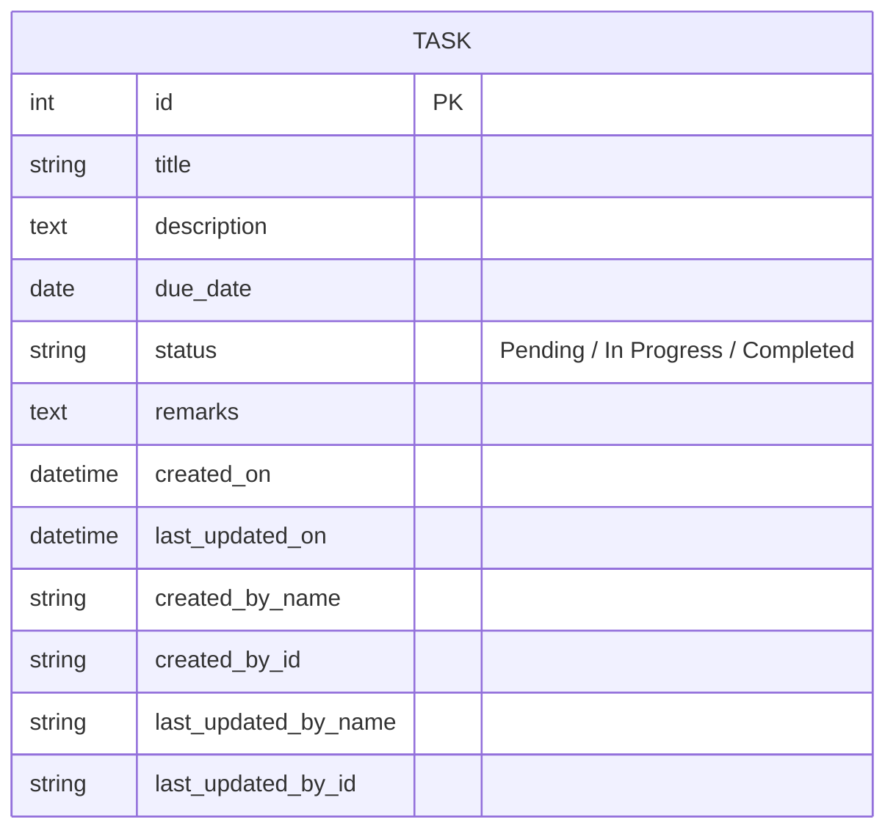

# 2.1.3.1. Overview of what is being built
This is a lightweight Task Management web application built with Python and Flask. This project strictly follows MVC pattern requirements for creating, reading, updating, deleting, and searching task records.

# 2.1.3.2. Explanation of DB Design
## 2.1.3.2.1. ER Diagram

The database structure relies on a single `Task` entity reflecting a flat architecture. 



## 2.1.3.2.2. Data Dictionary
**Table:** `task`
| Column Name            | Data Type      | Nullability | Default | Description |
|------------------------|----------------|------------|---------|-------------|
| `id`                   | Integer        | Not Null   | Auto-Increment | Primary Key |
| `title`                | String(100)    | Not Null   | None    | Task Title  |
| `description`          | Text           | Nullable   | None    | Task detailed description |
| `due_date`             | Date           | Nullable   | None    | Due date of the task |
| `status`               | String(20)     | Not Null   | 'Pending' | Current status |
| `remarks`              | Text           | Nullable   | None    | Task remarks |
| `created_on`           | DateTime       | Not Null   | utcnow  | Task creation timestamp |
| `last_updated_on`      | DateTime       | Not Null   | utcnow  | Task last update timestamp |
| `created_by_name`      | String(100)    | Not Null   | None    | Creator's Name |
| `created_by_id`        | String(50)     | Not Null   | None    | Creator's ID |
| `last_updated_by_name` | String(100)    | Not Null   | None    | Last Updater's Name |
| `last_updated_by_id`   | String(50)     | Not Null   | None    | Last Updater's ID |

## 2.1.3.2.3. Documentation of Indexes used
- A **Primary Key index** is automatically created on the `id` column for uniquely identifying tasks and improving lookup performance. No other explicit custom indexes are defined due to the simplicity of the single-table architecture.

## 2.1.3.2.4. Whether Code first or DB First approach has been used and why?
**Code First Approach** has been used.
A Code First approach (via Flask-SQLAlchemy) was chosen because it allows the developer to define the database schema directly using Python classes (`models.py`). This guarantees alignment between application object structures (models) and the database schema itself, simplifying version control, rapid prototyping, and enabling automated database schema generation (`db.create_all()`) without writing explicit SQL statements.

# 2.1.3.3. Structure of the application
## 2.1.3.3.2. Standard MVC server side page rendering

Standard MVC (Model-View-Controller) server-side page rendering approach has been used. The architecture is composed of:
*   **Model (`models.py`)**: Data abstraction layer interacting with SQLite using SQLAlchemy. Contains the `Task` entity.
*   **View (`templates/`)**: Jinja2 HTML templates which are rendered server-side and sent directly to the client.
*   **Controller (`routes.py`)**: Web request endpoint definitions containing business logic that securely connects views to the models.

*(A Single Page Application approach was not used to maintain simplicity and rapid server-rendered component loading).*

# 2.1.3.4. Frontend Structure
## 2.1.3.4.1. What kind of frontend has been used and why?
A standard **Web Page Frontend** has been built utilizing standard server-side rendering (HTML, Jinja2 Templates) styled with Tailwind CSS via CDN.
This approach was chosen because it perfectly synergizes with Flask's templating engine, drastically reducing complexity compared to separating a front-end framework (React, Angular). The use of Tailwind CSS ensures a responsive, highly-customizable interface with a minimal design payload. All of this can be achieved within the same monolithic architecture context without requiring a complex build step for the frontend itself.

# 2.1.3.5. Build and install
## 2.1.3.5.1. Environment details along with list of dependencies
**Environment Details:** Python 3.x with a SQLite file-based standalone database (`instance/site.db`).

**List of Dependencies (from `requirements.txt`):**
- Flask==3.0.0
- Flask-SQLAlchemy==3.1.1
- Flask-Login==0.6.3
- Flask-Bcrypt==1.0.1
- Flask-WTF==1.2.1
- WTForms==3.1.1
- email_validator==2.1.0.post1

## 2.1.3.5.2. Instructions on how to compile or build a project.
Because Python is an interpreted language and the frontend directly uses HTML templates without a compilation step (Tailwind CSS loaded via CDN), there is **no specific build or compile process needed** for this application. It can be directly executed using the Python interpreter once dependencies are installed.

## 2.1.3.5.3. Instructions on how to run or install the project
Ensure you have **Python 3.x** installed on your system. 

1. **Setup the Environment**: Open your terminal in this directory (`TaskManager/ManagingTask`) and create a Python virtual environment:
   ```bash
   python -m venv venv
   ```

2. **Activate the Virtual Environment**:
   - On Windows: 
     ```bash
     .\venv\Scripts\activate
     ```
   - On Mac/Linux:
     ```bash
     source venv/bin/activate
     ```

3. **Install Dependencies**:
   While the virtual environment is active, install the required packages using `pip`:
   ```bash
   pip install -r requirements.txt
   ```

4. **Run the Application**:
   Start the Flask development server:
   ```bash
   python app.py
   ```
   *(Note: The database tables will be automatically initialized during the first run via `db.create_all()`).*

5. **Access the Web App**: Open your web browser and navigate to:
   `http://127.0.0.1:5000/`

# 2.1.3.6. General Documentation not covered here
- **Search System Integration:** Simple text-based search functionality allows querying across both title and description fields using the server-rendered view via the `/?search=xxx` route query parameter.
- **Form Handling:** Flask-WTF is heavily utilized for structured web form intake, validation, and CSRF protection when creating and updating Task records.
